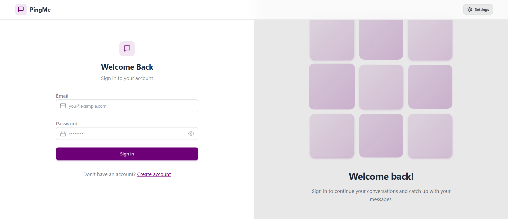

# 💬 Real-Time Chat App

A full-stack real-time chat application built with the **MERN stack** and **Socket.io**, supporting private messaging with authentication.

## 🚀 Features

- 🔒 User Authentication (JWT-based)
- 💬 Real-time messaging with Socket.io
- 🧑‍🤝‍🧑 Private Chats
- 📄 Message history and latest messages
- 🌐 RESTful API with Express.js
- 🎨 Responsive UI using React

## 🛠️ Tech Stack

**Frontend**: React, Axios, Vite, Tailwind CSS  
**Backend**: Node.js, Express.js, MongoDB, Mongoose, Socket.io  
**Auth**: JWT, bcrypt  
**Others**: Postman (API testing), Git, GitHub

## 📷 Demo

[Demo](https://chat-app-ivhk.onrender.com/)





## 🧪 How to Run Locally
### 📦 Prerequisites
- Node.js
- MongoDB (local or MongoDB Atlas)

### 🔧Backend Setup

```bash
cd backend
npm install
# Create a .env file and add your Mongo URI and JWT secret
npm run dev
```

### 🔧Frontend Setup
```bash
cd frontend
npm install
npm run dev


